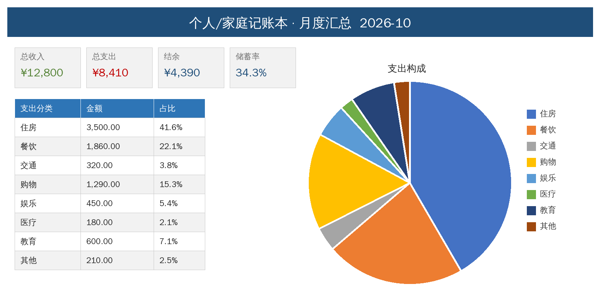
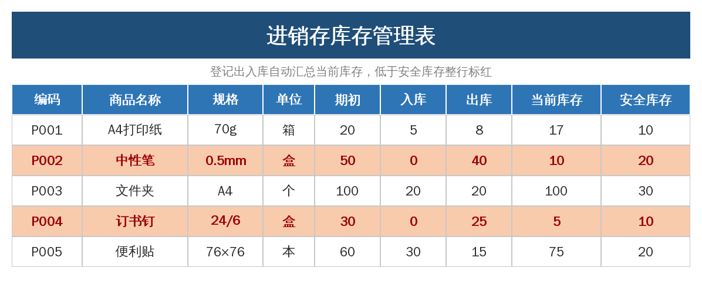

# office-templates · 职场 Excel 自动化模板生成器

[](https://github.com/racio-dio/office-templates/actions/workflows/ci.yml)

一行命令生成 5 套**填数即自动计算**的中文办公 Excel 模板。纯 Python + openpyxl，Excel / WPS 都能直接打开。

两条用法：

- **直接用**：带上公司名和名单，生成的模板就是能用的，不用再一个个改名字
- **自己定义**：写一份 YAML，不用碰 Python 就能生成你自己的表

## 快速开始

```bash
pip install -r requirements.txt
python build.py
```

运行后 `dist/` 下会出现 5 个 `.xlsx` 文件。黄色格子是需要填写的地方，其余全部公式自动算。

也可以装成命令行工具，装完在任何目录下都能直接用：

```bash
pip install -e .
office-templates --list
office-templates -o ./我的模板
```

## 生成你自己公司的模板

```bash
python build.py -c 某某科技 --staff 张三,李四,王五 --departments 销售部,技术部
python build.py --staff-file names.txt --year 2026 --month 11
python build.py --config examples/params.json
```

| 参数 | 作用 | 影响哪些模板 |
|---|---|---|
| `-c, --company` | 公司名，加在每套模板标题前 | 全部 5 套 |
| `--staff` | 员工名单，逗号分隔 | 考勤、工资、甘特负责人、进销存经手人 |
| `--staff-file` | 名单文件，一行一个姓名，`#` 开头为注释 | 同上 |
| `--departments` | 部门列表，逗号分隔 | 工资表（按名单轮换分配） |
| `--year` / `--month` | 年份 / 月份 | 考勤、记账、进销存 |
| `--social-rate` | 社保个人比例，如 `0.105` | 工资表 |
| `--fund-rate` | 公积金比例，如 `0.07` | 工资表 |
| `--start-date` | 项目起始日 `YYYY-MM-DD` | 甘特图 |
| `--config` | JSON 配置文件，批量指定以上参数 | 全部 |

参数优先级：**命令行显式指定 > 配置文件 > 默认值**。报错会给出明确提示，退出码为 2。

配置文件写法见 [`examples/params.json`](examples/params.json)。考勤表和工资表的行数会自动跟着名单长度扩展——40 人的名单就生成 40 行，不用手动加。

## 用 YAML 定义自己的模板

内置模板满足不了时，写一份 YAML 就行，不用改 Python：

```bash
python build.py --spec examples/specs/差旅报销单.yaml
python build.py --spec my.yaml -c 某某科技 -o ./out
```

`--spec` 可以传多份定义；不指定 `-t` 时只生成这些自定义模板，指定 `-t` 则和内置模板一起生成。

一份完整的定义（[`examples/specs/差旅报销单.yaml`](examples/specs/差旅报销单.yaml)）：

```yaml
filename: 06_差旅报销单.xlsx
title: 差旅费报销单
subtitle: 填写黄色区域；金额自动汇总，单笔超 1000 元自动标红

sheets:
  - name: 报销明细
    header_row: 3
    rows: 30
    freeze: A4
    totals: true
    columns:
      - {label: 日期, width: 12, type: date, format: yyyy-mm-dd, fill: FFF9E5}
      - {label: 类型, width: 10, choices: [交通, 住宿, 餐饮, 办公用品, 其他]}
      - {label: 金额, width: 12, type: number, format: "#,##0.00", total: true, sample: [553, 680]}
      - {label: 备注, width: 24}
    conditionals:
      - range: "A{r1}:D{last}"
        when: "$C{r1}>1000"
        font_color: C00000
        bold: true

  - name: 按类型汇总
    header_row: 3
    rows: 5
    totals: true
    columns:
      - {label: 类型, width: 14, sample: [交通, 住宿, 餐饮, 办公用品, 其他]}
      - {label: 金额, width: 14, format: "#,##0.00", total: true,
         formula: "=SUMIFS(报销明细!$C:$C,报销明细!$B:$B,A{r})"}
      - {label: 占比, width: 10, format: "0.0%", formula: "=IFERROR(B{r}/$B${total},0)"}
```

### 字段说明

| 层级 | 字段 | 说明 |
|---|---|---|
| 顶层 | `filename` | 输出文件名，必须以 `.xlsx` 结尾 |
| | `title` / `subtitle` | 标题与副标题（工作表可用同名字段覆盖） |
| | `sheets` | 工作表列表，至少一张 |
| 工作表 | `name` / `columns` | 表名与列定义（必填） |
| | `header_row` / `rows` | 表头所在行（默认 3）、数据行数（默认 30） |
| | `freeze` | 冻结窗格，如 `A4` |
| | `totals` | 是否在数据区下方加合计行，对 `total: true` 的列求和 |
| | `conditionals` | 条件格式列表 |
| 列 | `label` | 列标题（必填） |
| | `type` | `text`（默认）/ `number` / `date` |
| | `width` / `format` | 列宽、数字格式（如 `#,##0.00`、`yyyy-mm-dd`、`0.0%`） |
| | `formula` | 公式，支持占位符；填了它就不填示例数据 |
| | `choices` | 下拉选项列表 |
| | `sample` | 示例数据，按行填入 |
| | `fill` | 底色（填 `FFF9E5` 表示这里是填写区） |
| | `total` | 是否参与合计行 |
| 条件格式 | `range` / `when` | 作用范围与条件公式，支持占位符 |
| | `font_color` / `fill` / `bold` | 命中后的样式 |

### 占位符

公式、条件格式的 `range` 和 `when` 里都能用：

| 占位符 | 含义 |
|---|---|
| `{r}` | 当前数据行 |
| `{r1}` | 数据区首行 |
| `{last}` | 数据区末行 |
| `{total}` | 合计行（没开 `totals` 时等于 `{last}`） |

定义写错会有明确报错（未知字段、缺必填项、类型不对），退出码 2。

## 命令行用法

```
python build.py [选项]        # 装成工具后把 python build.py 换成 office-templates
```

| 选项 | 说明 |
|---|---|
| `-o, --out-dir <目录>` | 输出目录，默认 `dist/` |
| `-t, --only <模板...>` | 只生成指定内置模板，编号或名称均可，空格或逗号分隔 |
| `--spec <文件...>` | 按 YAML/JSON 定义生成自定义模板 |
| `-l, --list` | 列出所有可用模板后退出 |
| `-q, --quiet` | 只输出错误信息 |
| `-V, --version` | 显示版本号 |
| `-c, --company <名称>` 等 | 模板参数，见「生成你自己公司的模板」 |
| `-h, --help` | 查看帮助 |

## 内置模板一览

| 编号 | 名称 | key | 能做什么 |
|---|---|---|---|
| 1 | 月度考勤统计表 | `kaoqin` | 下拉标记 √/迟/假/旷/休，自动统计出勤率，周末自动标红，日期随年月变化 |
| 2 | 工资计算与工资条 | `gongzi` | 社保、公积金按比例自动扣，个税按七级累进简化计算，一键生成可打印工资条 |
| 3 | 项目进度甘特图 | `gantt` | 改开始日期和工期，色块自动生成；进度条、今日红线、延期自动提示 |
| 4 | 个人/家庭记账本 | `jizhang` | 分类下拉记账，月度汇总、储蓄率、支出构成饼图自动出 |
| 5 | 进销存库存管理 | `kucun` | 登记出入库，当前库存自动汇总，低于安全库存自动标红 |

## 预览

### 月度考勤统计表


### 工资计算与工资条


### 项目进度甘特图


### 个人/家庭记账本


### 进销存库存管理


## 项目结构

```
office-templates/
├── build.py                    # 命令行入口（python build.py）
├── office_templates/
│   ├── __init__.py             # 版本号与对外 API
│   ├── options.py              # 模板参数（公司名、名单、部门、比例…）
│   ├── spec.py                 # 声明式模板定义（YAML/JSON → 数据类）
│   ├── render.py               # 把定义渲染成 Workbook
│   ├── styles.py               # 配色常量与标题/表头/正文排版工具
│   ├── registry.py             # 内置模板注册表、选择解析、落盘
│   ├── cli.py                  # argparse 命令行
│   └── templates/              # 内置模板，每套一个模块
│       ├── kaoqin.py           # 01 考勤
│       ├── gongzi.py           # 02 工资
│       ├── gantt.py            # 03 甘特图
│       ├── jizhang.py          # 04 记账本
│       └── kucun.py            # 05 进销存
├── examples/
│   ├── params.json             # 参数配置示例
│   ├── staff.txt               # 名单文件示例
│   └── specs/差旅报销单.yaml   # 声明式模板示例
├── tests/                      # 冒烟测试 + 声明式测试
├── .github/workflows/ci.yml    # CI：Python 3.9/3.11/3.13 跑测试并产出模板
├── pyproject.toml              # 包元数据与 office-templates 命令入口
├── requirements.txt
└── screenshots/
```

也可以当库用：

```python
from office_templates import Options, build_templates, resolve

opts = Options(company="某某科技", staff=("张三", "李四"), month=11)
build_templates(resolve(["kaoqin", "gongzi"]), "./out", opts)
```

```python
from office_templates import load_spec, render_spec

wb = render_spec(load_spec("my.yaml"), Options(company="某某科技"))
wb.save("out/我的模板.xlsx")
```

## 新增一套内置模板

1. 在 `office_templates/templates/` 下新建模块，提供四个名字：

   ```python
   KEY = "baoxiao"                    # 命令行用的短名
   FILENAME = "07_差旅报销单.xlsx"     # 输出文件名
   DESC = "一句话说明"                 # --list 里显示
   def build(options: Options) -> Workbook: ...   # 造完 Workbook 直接返回，不要 save
   ```

2. 在 `office_templates/templates/__init__.py` 的 `MODULES` 里登记。

适合用代码写的（甘特图色块、饼图这类复杂效果）走这条路；结构规整的表直接用 YAML 定义更快。想让内置模板响应新参数，往 `options.py` 的 `Options` 加字段，再到 `cli.py` 的 `OPTION_FIELDS` 登记即可。

## 开发

```bash
python -m unittest discover -s tests -v
```

测试覆盖四件事：每套模板都能生成且能被重新打开、参数校验边界、参数确实落到单元格、以及 YAML 定义能正确渲染。每次 push 和 PR 都会在 Python 3.9 / 3.11 / 3.13 上跑同一套测试，并把生成的模板作为构建产物上传。

## 说明

- 需要 Python 3.9+。运行依赖 `openpyxl`（生成 xlsx）和 `PyYAML`（YAML 模板定义）。
- 个税为月度简化算法（起征点 5000），仅供参考，正式发薪请以累计预扣法为准。
- 欢迎提 Issue 说想要什么模板，点个 ⭐ 支持一下，会持续更新。

## License

MIT
