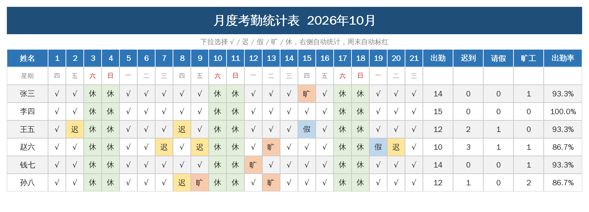
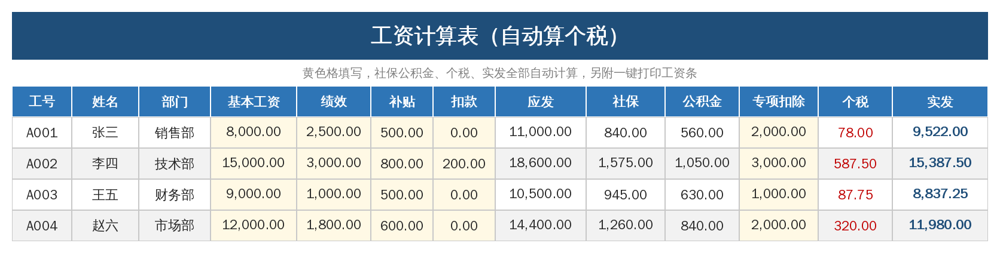
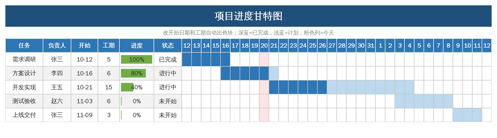

# office-templates · 职场 Excel 自动化模板生成器

[English](README.md) | 中文

[](https://github.com/racio-dio/office-templates/actions/workflows/ci.yml)

一行命令生成 5 套**填数即自动计算**的中文办公 Excel 模板。纯 Python + openpyxl，Excel / WPS 都能直接打开。

两条用法：

- **直接用**：带上公司名和名单，生成的模板就是能用的，不用再一个个改名字
- **自己定义**：写一份 YAML，不用碰 Python 就能生成你自己的表

## 快速开始

```bash
pip install -r requirements.txt
python build.py
```

运行后 `dist/` 下会出现 5 个 `.xlsx` 文件。黄色格子是需要填写的地方，其余全部公式自动算。

也可以装成命令行工具，装完在任何目录下都能直接用：

```bash
pip install -e .
office-templates --list
office-templates -o ./我的模板
```

命令行界面支持中英双语（`--lang zh` / `--lang en`），默认按环境语言判断，也可用环境变量 `OFFICE_TEMPLATES_LANG` 指定。

## 生成你自己公司的模板

```bash
python build.py -c 某某科技 --staff 张三,李四,王五 --departments 销售部,技术部
python build.py --staff-file names.txt --year 2026 --month 11
python build.py --config examples/params.json
```

| 参数 | 作用 | 影响哪些模板 |
|---|---|---|
| `-c, --company` | 公司名，加在每套模板标题前 | 全部 5 套 |
| `--staff` | 员工名单，逗号分隔 | 考勤、工资、甘特负责人、进销存经手人 |
| `--staff-file` | 名单文件，一行一个姓名，`#` 开头为注释 | 同上 |
| `--departments` | 部门列表，逗号分隔 | 工资表（按名单轮换分配） |
| `--year` / `--month` | 年份 / 月份 | 考勤、记账、进销存 |
| `--social-rate` | 社保个人比例，如 `0.105` | 工资表 |
| `--fund-rate` | 公积金比例，如 `0.07` | 工资表 |
| `--start-date` | 项目起始日 `YYYY-MM-DD` | 甘特图 |
| `--config` | JSON 配置文件，批量指定以上参数 | 全部 |

参数优先级：**命令行显式指定 > 配置文件 > 默认值**。报错会给出明确提示，退出码为 2。

配置文件写法见 [`examples/params.json`](examples/params.json)。考勤表和工资表的行数会自动跟着名单长度扩展——40 人的名单就生成 40 行，不用手动加。

## 用 YAML 定义自己的模板

```bash
python build.py --spec examples/specs/差旅报销单.yaml
python build.py --spec my.yaml -c 某某科技 -o ./out
```

定义文件的字段说明、占位符（`{r}` `{r1}` `{last}` `{total}`）与完整示例见 [英文版 README](README.md#define-your-own-template-in-yaml)，或参考 [`examples/specs/差旅报销单.yaml`](examples/specs/差旅报销单.yaml)。

## 内置模板一览

| 编号 | 名称 | key | 能做什么 |
|---|---|---|---|
| 1 | 月度考勤统计表 | `kaoqin` | 下拉标记 √/迟/假/旷/休，自动统计出勤率，周末自动标红 |
| 2 | 工资计算与工资条 | `gongzi` | 社保、公积金按比例自动扣，个税按七级累进简化计算 |
| 3 | 项目进度甘特图 | `gantt` | 改开始日期和工期，色块自动生成；今日红线、延期提示 |
| 4 | 个人/家庭记账本 | `jizhang` | 分类下拉记账，月度汇总、储蓄率、支出构成饼图 |
| 5 | 进销存库存管理 | `kucun` | 登记出入库，当前库存自动汇总，低于安全库存标红 |

## 预览

  

## 开发

```bash
python -m unittest discover -s tests -v
```

## 说明

- 需要 Python 3.9+。运行依赖 `openpyxl`（生成 xlsx）和 `PyYAML`（YAML 模板定义）。
- 个税为月度简化算法（起征点 5000），仅供参考，正式发薪请以累计预扣法为准。

## License

MIT
